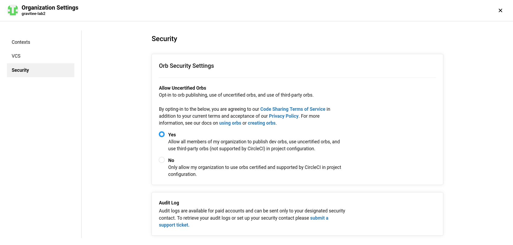

# Orbinoïd

Make your Circle CI Orb Dev Cycle easy 

## Why the `Orbinoïd` ?


Although we are all happy to find in Circle CI 2, a way to buildre-usable CICD bricks (modularization, CI CD wit Infra-As-Code), Developing a
Circle CI `Orb`, as I experienced it, is made very tedious by the design of the `Circle CI CLI`, and of the lifecycle management of an `Orb`.

I experienced that using `Circle CI CLI` version `0.1.10803+6189238 (release)` :

* Official Installation procedure fails
* Initializing an Orb project from a starter fails (see https://github.com/CircleCI-Public/circleci-cli/issues/491)
* And global process is not really easy to grasp, especially regarding `Circle CI Orbs`-specific concepts such as a namepsace (e.g. once a namespacehas been created, in the Obregistry, I still today haven't found how to delete it.)
* and see _**ANNEX A : List of Circle CI `Orb` lifecycle management oddities**_ for a lot more


This is why I designed the `Orbinoïd` : A `TypeScript` utility which manages for you all this complexity (and speeds up the Orb development cycle).

## how to use `Orbinoïd` it work, in a Nutshell


* It is configured from a `.env` file, which allows you to configure things like `Circle CI CLI` authentication
* run `npm start -- --init`, will spawn up a new `Orb` project'ssource int the `orb/` Folder. The "starter" is configured

## `Orbinoïd` Dependencies

Minimal GNU/Linux utilities, all installable usingthe package manager, of many GNU/Linux distributions, and other `*NIX` Oses :

* `git`
* `tree`

And of course `nodejs`, since `Orbinoïd`is developed in `NodeJS/TypeScript`.


## `Orbinoïd` friends

* https://github.com/gravitee-lab/orb-starter : a starter project for an Orb

## ANNEX A : List of Circle CI `Orb` lifecycle management oddities


* if you try and create a namespace, in a remote `Orb` registry, for a given `github` / `bitbucket` Organization (`VCS_ORG_NAME`), if you did not give permissions to acess the organization to the circleci github oauth application, you will get this error :

```bash
=== Creating Circle CI Orb namespace in remote Orb registry
Error: Unable to find organization gravitee-lab2 of vcs-type GITHUB: Must have member permission.: the organization 'gravitee-lab2' under 'GITHUB' VCS-type does not exist. Did you misspell the organization or VCS?
Error Creating Circle CI Orb namespace [Orbinoïd]
```


* Once you created a namespace, in a remote `Orb` registry, you cannot create any other, for the same github / bitbucket Organization (`VCS_ORG_NAME`) it, if you try to you will get this error :

```bash
=== Creating Circle CI Orb namespace in remote Orb registry
Error: Organizations may only create one namespace. This organization owns the following namespace: "Orbinoïd"
Error Creating Circle CI Orb namespace [othernamespace]
```
* Once you created a namespace, in a remote `Orb` registry, you cannot create it for any other github / bitbucket Organization (`VCS_ORG_NAME`), if you try to you will get this error :

```bash
=== Creating Circle CI Orb namespace in remote Orb registry
Error: Cannot create namespace 'Orbinoïd': a namespace with that name already exists.
Error Creating Circle CI Orb namespace [Orbinoïd]
```

* If you want to create an un-certified `Orb`, in a remote Org registry, for a given `Orb` namespace, you need to authorize un-certified publishing un-certified `Orb`s for your `github` / `bitbucket` Organization (`VCS_ORG_NAME`) in Circle CI serverOrganization settings, or you will get the following error :

```bash
=== Creating Circle CI Orb in remote Orb registry
Error: Your organization must enable the 'Uncertified Orbs' feature in org settings to create orbs
Error Creating Circle CI Orb [gravitee-dev-repos] in remote Orb registry
```




* Once you created a repo, in a remote `Orb` registry, you cannot create any other with the same name, for the same `Orb` namespace. if you try to you will get this error :

```bash
=== Creating Circle CI Orb in remote Orb registry
Error: Cannot create an Orb named 'gravitee-dev-repos': an Orb with that name already exists.
Error Creating Circle CI Orb [gravitee-dev-repos] in remote Orb registry
```

* Once you deployed a version `x.y.z` of an `Orb`, you cannot re-deploy it, if you try to you will get this error :

```bash
=== Publishing Circle CI Orb to remote Orb registry
Error: orb revision already exists
Error Publishing Circle CI Orb [gravitee-dev-repos] in remote Orb registry
```
